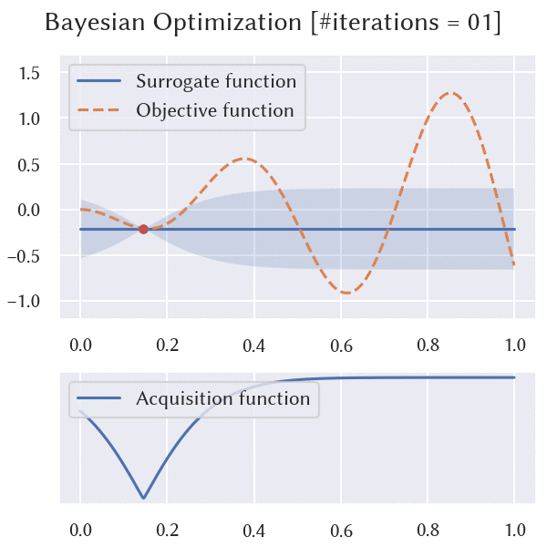
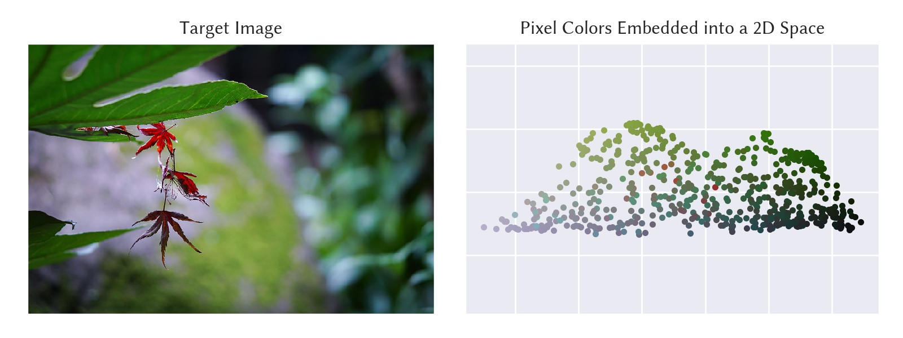

# mathtoolbox


Mathematical tools (interpolation, dimensionality reduction, optimization, etc.) written in C++11 and [Eigen](http://eigen.tuxfamily.org/).


## Algorithms

### Scattered Data Interpolation and Function Approximation

- [`rbf-interpolation`: Radial basis function (RBF) interpolation](https://yuki-koyama.github.io/mathtoolbox/rbf-interpolation/)
- [`gaussian-process-regression`: Gaussian process regression (GPR)](https://yuki-koyama.github.io/mathtoolbox/gaussian-process-regression/)

### Dimensionality Reduction and Low-Dimensional Embedding

- [`classical-mds`: Classical multi-dimensional scaling (MDS)](https://yuki-koyama.github.io/mathtoolbox/classical-mds/)
- [`som`: Self-organizing map (SOM)](https://yuki-koyama.github.io/mathtoolbox/som/)

### Numerical Optimization

- [`backtracking-line-search`: Backtracking line search](https://yuki-koyama.github.io/mathtoolbox/backtracking-line-search/)
- [`bayesian-optimization`: Bayesian optimization](https://yuki-koyama.github.io/mathtoolbox/bayesian-optimization/)
- [`bfgs`: BFGS method](https://yuki-koyama.github.io/mathtoolbox/bfgs/)
- [`gradient-descent`: Gradient descent method](https://yuki-koyama.github.io/mathtoolbox/gradient-descent/)
- [`l-bfgs`: Limited-memory BFGS method](https://yuki-koyama.github.io/mathtoolbox/l-bfgs/)
- [`strong-wolfe-conditions-line-search`: Strong Wolfe conditions line search](https://yuki-koyama.github.io/mathtoolbox/strong-wolfe-conditions-line-search/)

### Linear Algebra

- [`log-determinant`: Log-determinant](https://yuki-koyama.github.io/mathtoolbox/log-determinant/)
- [`matrix-inversion`: Matrix inversion techniques](https://yuki-koyama.github.io/mathtoolbox/matrix-inversion/)

### Utilities

- [`acquisition-functions`: Acquisition functions](https://yuki-koyama.github.io/mathtoolbox/acquisition-functions/)
- [`constants`: Constants](https://yuki-koyama.github.io/mathtoolbox/constants/)
- [`data-normalization`: Data normalization](https://yuki-koyama.github.io/mathtoolbox/data-normalization/)
- [`kernel-functions`: Kernel functions](https://yuki-koyama.github.io/mathtoolbox/kernel-functions/)
- [`probability-distributions`: Probability distributions](https://yuki-koyama.github.io/mathtoolbox/probability-distributions/)

## Dependencies

### Main Library

- Eigen <http://eigen.tuxfamily.org/> (`brew install eigen` / `sudo apt install libeigen3-dev`)

### Python Bindings

- pybind11 <https://github.com/pybind/pybind11> (included as gitsubmodule)

### Examples

- optimization-test-function <https://github.com/yuki-koyama/optimization-test-functions> (included as gitsubmodule)
- timer <https://github.com/yuki-koyama/timer> (included as gitsubmodule)

## Use as a C++ Library

mathtoolbox uses CMake <https://cmake.org/> for building source codes. This library can be built, for example, by
```
git clone https://github.com/yuki-koyama/mathtoolbox.git --recursive
cd mathtoolbox
mkdir build
cd build
cmake ../
make
```
and optionally it can be installed to the system by
```
make install
```

When the CMake parameter `MATHTOOLBOX_BUILD_EXAMPLES` is set `ON`, the example applications are also built. (The default setting is `OFF`.) This is done by
```
cmake ../ -DMATHTOOLBOX_BUILD_EXAMPLES=ON
make
```

When the CMake parameter `MATHTOOLBOX_PYTHON_BINDINGS` is set `ON`, the example applications are also built. (The default setting is `OFF`.) This is done by
```
cmake ../ -DMATHTOOLBOX_PYTHON_BINDINGS=ON
make
```

### Prerequisites

macOS:
```
brew install eigen
```

Ubuntu:
```
sudo apt install libeigen3-dev
```

## Use as a Python Library

pymathtoolbox is a (sub)set of Python bindings of mathtoolbox. Tested on Python `3.6`, `3.7`, and `3.8`.

It can be installed via PyPI:
```
pip install git+https://github.com/yuki-koyama/mathtoolbox
```

### Prerequisites

macOS
```
brew install cmake eigen
```

Ubuntu 16.04/18.04
```
sudo apt install cmake libeigen3-dev
```

### Examples

See [python-examples](https://github.com/yuki-koyama/mathtoolbox/tree/master/python-examples).

## Gallery

__Bayesian optimization__ (`bayesian-optimization`) solves a one-dimensional optimization problem using only a small number of function-evaluation queries.



__Classical multi-dimensional scaling__ (`classical-mds`) is applied to pixel RGB values of a target image to embed them into a two-dimensional space.



__Self-organizing map__ (`som`) is also applicable to pixel RGB values of a target image to learn a two-dimensional color manifold.


## Projects Using mathtoolbox

- SelPh [CHI 2016] <https://github.com/yuki-koyama/selph>
  - `classical-mds`
- Sequential Line Search [SIGGRAPH 2017] <https://github.com/yuki-koyama/sequential-line-search>
  - `acquisition-functions`, `data-normalization`, `kernel-functions`, `log-determinant`, and `probability-distributions`
- Sequential Gallery [SIGGRAPH 2020] <https://github.com/yuki-koyama/sequential-gallery> 
  - `acquisition-functions` and `probability-distributions`
- elasty <https://github.com/yuki-koyama/elasty>
  - `l-bfgs`

## Contributing

Bug reports, suggestions, feature requests, and PRs are highly welcomed.

## Licensing

The MIT License.
