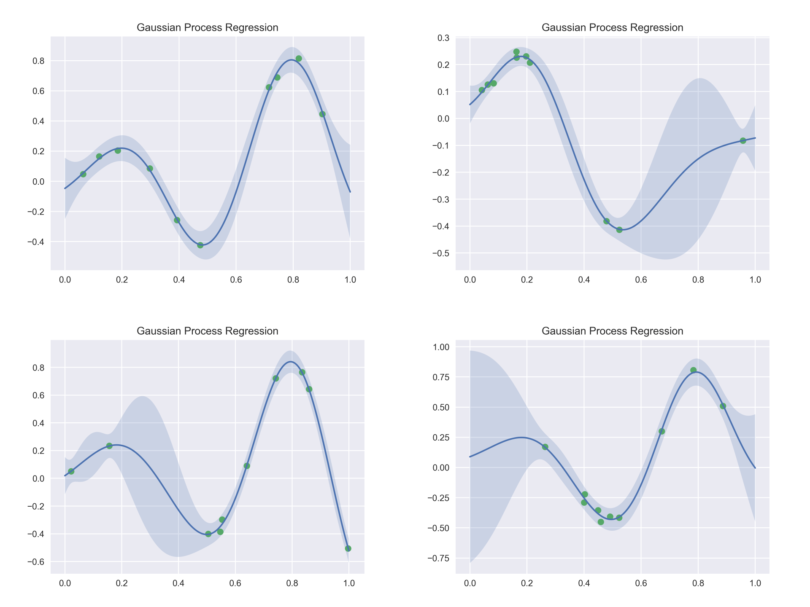

# gaussian-process-regression

Gaussian process regression (GPR) for scattered data interpolation and function approximation.



## Header

```
#include <mathtoolbox/gaussian-process-regression.hpp>
```

## Overview

### Input

The input consists of a set of $ N $ scattered data points:

$$
\{ (\mathbf{x}_i, y_i) \}_{i = 1, \ldots, N},
$$

where $ \mathbf{x}_i \in \mathbb{R}^D $ is the $ i $-th data point location in a $ D $-dimensional space and $ y_i \in \mathbb{R} $ is its associated value. This input data is also denoted as

$$
\mathbf{X} = \begin{bmatrix} \mathbf{x}_{1} & \cdots & \mathbf{x}_{N} \end{bmatrix} \in \mathbb{R}^{D \times N}
$$

and

$$
\mathbf{y} = \begin{bmatrix} y_1 \\ \vdots \\ y_N \end{bmatrix} \in \mathbb{R}^{N}.
$$

### Output

Given the data and some "Gaussian process" assumptions, GPR can calculate the most likely value $ y $ and its variance $ \text{Var}(y) $ for an arbitrary location $ \mathbf{x} $. 

The variance roughly indicates how uncertain the estimation is. For example, when this value is large, the estimated value may not be very trustful (this often occurs in regions with less data points).

Note that a 95%-confidence interval can be obtained by $ [ y - 1.96 \sqrt{\text{Var}(y)}, y + 1.96 \sqrt{\text{Var}(y)} ] $.

## Math

### Coveriance Function

The automatic relevance determination (ARD) squared exponential kernel is used:

$$
k(\mathbf{x}_p, \mathbf{x}_q) = \sigma_f^{2} \exp \left( - \frac{1}{2} (\mathbf{x}_p - \mathbf{x}_q)^{T} \text{diag}(\boldsymbol{\ell})^{-2} (\mathbf{x}_p - \mathbf{x}_q) \right) + \sigma_n^{2} \delta_{pq},
$$

where $ \sigma_f^{2} $ (the signal variance), $ \sigma_n^{2} $ (the noise level), and $ \boldsymbol{\ell} $ (the characteristic length-scales) are hyperparameters.

### Mean Function

A constant-value function is used:

$$
m(\mathbf{x}) = 0.
$$

### Selecting Hyperparameters

There are two options for setting hyperparameters:
- Set manually
- Determined by the maximum likelihood estimation

#### Maximum Likelihood Estimation

Let $ \boldsymbol{\theta} $ be a concatenation of hyperparameters; that is, 

$$
\boldsymbol{\theta} = \begin{bmatrix} \sigma_{f}^{2} \\ \sigma_{n}^{2} \\ \boldsymbol{\ell} \end{bmatrix} \in \mathbb{R}^{D + 2}.
$$

In this approach, these hyperparameters are determined by solving the following numerical optimization problem:

$$
\boldsymbol{\theta}^\text{ML} = \mathop{\rm arg~max}\limits_{\boldsymbol{\theta}} p(\mathbf{y} \mid \mathbf{X}, \boldsymbol{\theta}).
$$

In this implementation, this maximization problem is solved by the L-BFGS method (a gradient-based local optimization algorithm) from the NLopt library <https://nlopt.readthedocs.io/>. Initial solutions for this maximization need to be specified.

## Usage

### Instantiation and Data Specification

A GPR object is instantiated with data specification in its constructor:
```
GaussianProcessRegression(const Eigen::MatrixXd& X, const Eigen::VectorXd& y);
```

### Hyperparameter Selection

Hyperparameters are set by either
```
void SetHyperparameters(double sigma_squared_f,
                        double sigma_squared_n,
                        const Eigen::VectorXd& length_scales);
```
or 
```
void PerformMaximumLikelihood(double sigma_squared_f_initial,
                              double sigma_squared_n_initial,
                              const Eigen::VectorXd& length_scales_initial);
```

### Estimation

Once a GPR object is instantiated and its hyperparameters are set, it is ready for estimation. For an unknown location $ \mathbf{x} $, the GPR object estimates the most likely value $ y $ by the following method:
```
double EstimateY(const Eigen::VectorXd& x) const;
```
It also estimates the variance $ \text{Var}(y) $ by the following method:
```
double EstimateVariance(const Eigen::VectorXd& x) const;
```

## Useful Resources

- Mark Ebden. 2015. Gaussian Processes: A Quick Introduction. [arXiv:1505.02965](https://arxiv.org/abs/1505.02965).
- Carl Edward Rasmussen and Christopher K. I. Williams. 2006. Gaussian Processes for Machine Learning. The MIT Press. Online version: <http://www.gaussianprocess.org/gpml/>
