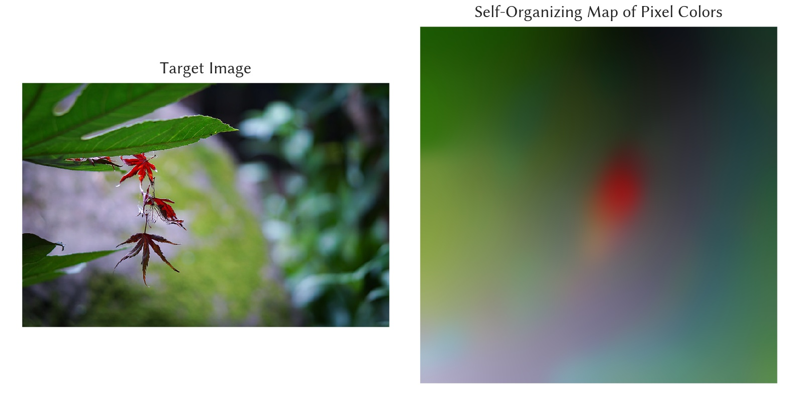

# som

Self-organizing map (SOM) for dimensionality reduction and low-dimensional embedding. This technique is useful for understanding high-dimensional data via visualization.

## Header

```cpp
#include <mathtoolbox/som.hpp>
```

## Internal Dependencies

- [data-normalization](../data-normalization)

## Math

### Update

This library implements a batch-style SOM algorithm rather than online-style ones.

### Neighborhood Function

This library uses a Gaussian function with a decreasing variance:

$$
\sigma^{2}(t) = \max \left[ \sigma^{2}_{0} \exp \left(- \frac{t}{s} \right), \sigma^{2}_{\min} \right],
$$

where $t$ is the iteration count, $s$ is a user-specified parameter for controlling the speed of decrease, and $\sigma^{2}_{0}$ and $\sigma^{2}_{\min}$ are user-specified initial and minimum variances, respectively.

### Data Normalization

This library offers an option to perform data normalization, which is recommended to use in general.

## Examples

The following is an example of applying the algorithm to the pixel RGB values of a target image and learning its 2D color manifold.


The above map was generated through 30 iterations. The learning process is visualized as below.
<video width="100%" src="./som-image.mp4" controls autoplay loop type="video/mp4">(Your browser doesn't support video playing.)</video>

Self-organizing map is often assumed to be two-dimensional, but it is also possible to use other dimensionalities for the latent space. The below is an example of learning a one-dimensional map.


## Useful Resources

- Chuong H. Nguyen, Tobias Ritschel, and Hans-Peter Seidel. 2015. Data-Driven Color Manifolds. ACM Trans. Graph. 34, 2, 20:1--20:9 (March 2015). DOI: <https://doi.org/10.1145/2699645>
